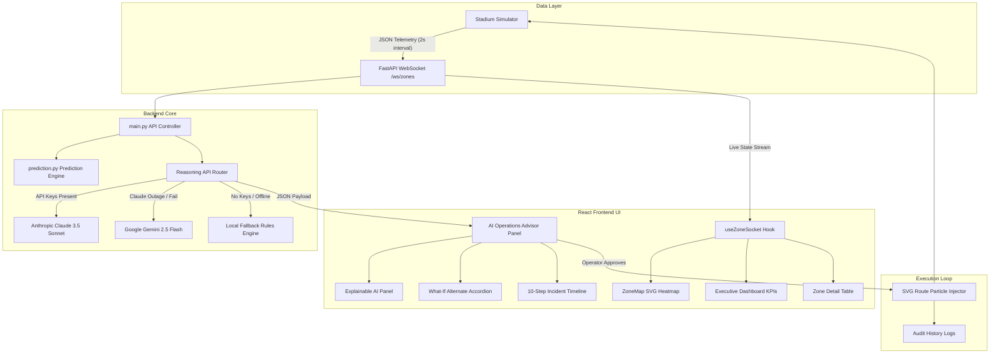

# ⚽ StadiumIQ: FIFA World Cup 2026 Control Room Copilot

<div align="center">
  
  
  
</div>

<p align="center">
  <strong>StadiumIQ</strong> is an AI-powered Operations Control Room Copilot built to manage spectator flow and prevent crowd crush incidents during the <strong>FIFA World Cup 2026</strong>.
</p>

<p align="center">
  By combining a <strong>mathematical prediction engine</strong> with <strong>Generative AI reasoning (Anthropic Claude & Google Gemini)</strong> and a <strong>real-time React control panel</strong>, StadiumIQ enables stadium commanders to visualize crowd flow topology, anticipate safety breaches before they occur, and deploy crowd redirection directives with confidence.
</p>

---

## 📌 Table of Contents
1. [Problem Statement](#-problem-statement)
2. [Solution Overview](#-solution-overview)
3. [Key Features](#-key-features)
4. [System Architecture & AI Workflow](#-system-architecture--ai-workflow)
5. [Tech Stack](#-tech-stack)
6. [Folder Structure](#-folder-structure)
7. [Installation & Setup](#-installation--setup)
8. [API & Configuration](#-api--configuration)
9. [Running the Application](#-running-the-application)
10. [Evaluation & Demo Guide](#-evaluation--demo-guide)
11. [Future Improvements](#-future-improvements)
12. [License](#-license)

---

## ⚠️ Problem Statement
During high-profile sporting events, spectator ingress is highly dynamic. Traditional security management relies on reactive responses *after* a gate reaches critical capacity or a bottleneck occurs. 

Late-stage crowd control leads to:
* **Egress & Ingress Bottlenecks**: Rapid crowd buildup at gates (e.g., Gate A, Gate C).
* **Communication Gaps**: Delayed deployment of safety announcements in spectator-native languages.
* **Lack of Data-Driven Alternatives**: Security marshals redirecting crowds to other gates without knowing if downstream concourses can absorb the extra load.

---

## 💡 Solution Overview
StadiumIQ addresses these challenges by transforming raw spectator telemetry into actionable, explainable safety directives:
1. **Mathematical Inflow Prediction**: Projects zone occupancy rates 2, 5, and 10 minutes into the future to warn of impending capacity breaches.
2. **Explainable AI (XAI) Panel**: Accompanies every recommendation with occupancy statistics, safety countdowns, and natural language reasoning.
3. **Dual-SDK Routing & High-Availability Fallback**: Dynamically routes reasoning requests to **Claude 3.5 Sonnet** (Primary) or **Gemini 2.5 Flash** (Secondary). If both external API endpoints are down, it switches to a rules-based **Local Fallback Engine** to guarantee 100% control room uptime.
4. **Audit Trail & Replay Mode**: Logs all completed crowd diversions, allowing commanders to run a post-incident playback to review congestion mitigation results.

---

## 🌟 Key Features

### 1. Executive Command Dashboard
* Renders 9 live operational KPI cards: **Total Spectators**, **Active Zones**, **Critical Zones**, **Active Recommendations**, **Active Diversions**, **Average Incident Response Time**, **Stadium Safety Score**, **Match Lifecycle Stage**, and **Active AI Engine**.
* Animated counter states flash when metrics change.

### 2. Predictive Heatmap Layer
* Integrates directly into the **Stadium Ingress & Flow Topology Map**.
* Operator can switch between three layers: **Current Occupancy**, **+5 Minutes Forecast**, and **+10 Minutes Forecast** to isolate incoming crowd surges.

### 3. Explainable AI (XAI) Widget
* Justifies every recommendation with:
  * Current occupancy vs. Safe capacity.
  * Predicted occupancy in 5 minutes.
  * Congestion growth rate (spectators/minute).
  * Recommended alternate gate wait-time reduction.
  * Dynamic AI confidence rating and meter.

### 4. What-If Alternative Analysis Accordion
* Compares the primary recommended route against secondary alternates.
* Highlights safety score net changes and clearance delays to help operators make informed decisions.

### 5. 10-Step Interactive Incident Timeline
* Visualizes the complete lifecycle of a crowd congestion event:
  `Telemetry Ingest ➔ Threshold Crossed ➔ AI Risk Search ➔ Operator Briefing ➔ Multilingual PA Announcements ➔ Operator Approval ➔ Signage Dispatch ➔ Resolution`.

### 6. Post-Incident Audits & Exports
* Displays detailed before-vs-after summaries (Density drops, queue length reduction, net safety improvements).
* Exports executive reports instantly to **Markdown (`.md`)**, **JSON**, or **PDF** (Print format).

### 7. Full Accessibility Control Center
* Accessible overlay supporting **Large Font Scaling (+25%)**, **High Contrast Mode**, and **Color-Blind Simulation** (optimized contrast filters).
* Persistent settings saved in `localStorage`.

---

## 🏗️ System Architecture & AI Workflow

### Data Flow & Component Mapping


---

## 🛠️ Tech Stack
* **Frontend**: React 18, Vite, HTML5 (Semantic elements & custom SVG topologies), Vanilla CSS (Glassmorphism & animations).
* **Backend**: Python 3.10+, FastAPI, Pydantic, Uvicorn.
* **AI Core**: Official Anthropic SDK (`anthropic`), Google Generative AI SDK (`google-generativeai`).
* **Unit Testing**: Pytest, Asyncio-test.

---

## 📂 Folder Structure
```text
stadiumiq/
├── backend/
│   ├── main.py                 # FastAPI application routing & WebSockets
│   ├── simulation.py           # Ingress/egress simulator, ticks & flow modeling
│   ├── reasoning.py            # AI reasoning engine & LLM dual-SDK setup
│   ├── prediction.py           # Mathematical queue predictions (2m, 5m, 10m)
│   ├── models.py               # Pydantic data schemas
│   ├── requirements.txt        # Python backend dependencies
│   └── tests/                  # Pytest unit & integration suite
│       ├── test_api.py
│       └── test_reasoning.py
│
├── frontend/
│   ├── src/
│   │   ├── main.jsx            # React root mount
│   │   ├── App.jsx             # Main container, layout & API hooks
│   │   ├── index.css           # Global theme, tokens & CSS glassmorphism
│   │   ├── styles.css          # Component layout stylings
│   │   └── components/         # Modular React UI widgets
│   │       ├── Dashboard.jsx
│   │       ├── ZoneMap.jsx
│   │       ├── ZoneDetailTable.jsx
│   │       ├── RecommendationPanel.jsx
│   │       ├── ChatPanel.jsx
│   │       ├── DispatchHistoryPanel.jsx
│   │       └── AccessibilityControlCenter.jsx
│   │
│   ├── package.json            # Node project configuration
│   └── vite.config.js          # Vite asset bundler config
│
└── README.md                   # Project documentation
```

---

## ⚙️ Installation & Setup

### Prerequisites
* **Python 3.10+** (ensure it is added to your environment PATH)
* **Node.js 18+**

### 1. Clone & Environment Configuration
Navigate to the project root folder `stadiumiq/` and set up your backend `.env` variables:

Create the file `backend/.env`:
```env
ANTHROPIC_API_KEY=your-anthropic-api-key-here
GEMINI_API_KEY=your-gemini-api-key-here
```
> [!NOTE]
> If both keys are absent, the application automatically runs in **Local Fallback** mode, displaying `Engine: Local Fallback` on the dashboard.

### 2. Backend Installation
Set up your Python virtual environment and install dependencies:
```powershell
cd backend
python -m venv .venv
# Activate in Windows PowerShell:
.venv\Scripts\Activate.ps1
# Install dependencies:
pip install -r requirements.txt
```

### 3. Frontend Installation
Install all React package dependencies:
```bash
cd ../frontend
npm install
```

---

## 🧪 Running Unit Tests
Validate the mathematical predictions, LLM routing fallbacks, and API endpoints:
```powershell
cd ../backend
# Run the test suite:
$env:PYTHONPATH="."
.venv\Scripts\python -m pytest
```

---

## 🚀 Running the Application

For the full real-time telemetry stream, run both the backend server and frontend development server.

### 1. Start FastAPI Backend (Port 8000)
From the `backend` directory (with virtual environment activated):
```bash
uvicorn main:app --host 127.0.0.1 --port 8000
```

### 2. Start Vite Frontend (Port 5173/5174)
From the `frontend` directory:
```bash
npm run dev
```
Open **[http://localhost:5173](http://localhost:5173)** in your web browser.

---

## 📖 Evaluation & Demo Guide

Follow these steps to experience the complete operations control workflow:

### Step 1: Baseline Monitoring
1. Start both servers and open the frontend URL.
2. The **Ingress & Flow Topology Map** displays all 9 zones with green (**NORMAL**) nodes.
3. The top **Executive Dashboard** shows real-time stats updating every 2 seconds via WebSockets.
4. The **AI Operations Advisor** shows nominal state alerts.

### Step 2: Triggering a Surge (WATCH Status)
1. Locate the **Demo Control Panel** at the bottom-left of the screen.
2. Click **Trigger Gate C Spike**.
3. In the topology map, **Gate C (Ingress)** changes to yellow (**WATCH** status).
4. In the **AI Operations Advisor** panel, an alert appears. Note the **Explainable AI** details: predicted densities, Alternate routes (Gate B), and estimated safety countdowns.

### Step 3: Escalation (CRITICAL Status)
1. Click **Trigger Gate C Spike** a second time.
2. Gate C occupancy exceeds 90% capacity, and the node turns red (**CRITICAL** status).
3. The timeline on the right updates to indicate the safety threshold breach. The AI recommendations suggest halting Gate C ingress and diverting spectators.

### Step 4: Redirection Dispatch & Workflow Wizard
1. Click **Deploy Crowd Response** on the recommendation card.
2. The **Dispatch Wizard Modal** opens, highlighting the 10-step progress sequence.
3. Step through the pages:
   * **Page 1: Impact Prediction**: Shows current queue vs. diverted queue metrics.
   * **Page 2: Multilingual PA Announcements**: View AI-generated localized audio announcements (English & Spanish).
   * **Page 3: Operator Approval**: Confirm and authorize dispatch.
4. Click **Approve & Deploy Response**. Watch the SVG map draw **animated blue dashed diversion paths** with active particle flows moving from Gate C to Gate B.

### Step 5: Post-Incident Audit & Replay
1. Once the redirect mitigates the bottleneck, the alert is resolved.
2. Go to the **Reports & Replay** tab in the right panel.
3. Select the completed incident to view the **Executive Operational Report** before-vs-after metrics table.
4. Click **Export MD** or **Export JSON** to download raw audits, or click **Print PDF** to trigger the system print layout.
5. Click **Replay Flow** to activate the slider-controlled playback overlay, letting you review each stage of the incident timeline.

---

## 🔮 Future Improvements
* **Direct Audio Broadcasts**: Link the multilingual text announcements to a browser Speech Synthesis API to speak the security commands aloud.
* **Spatial CCTV Coordinates Integration**: Add camera streams overlays when clicking a topology map node.
* **Global GIS Overlays**: Expand the SVG canvas to a Leaflet/Mapbox coordinate layout for larger stadium perimeters.

---

## 📄 License
This project is licensed under the MIT License - see the [LICENSE](LICENSE) file for details.
